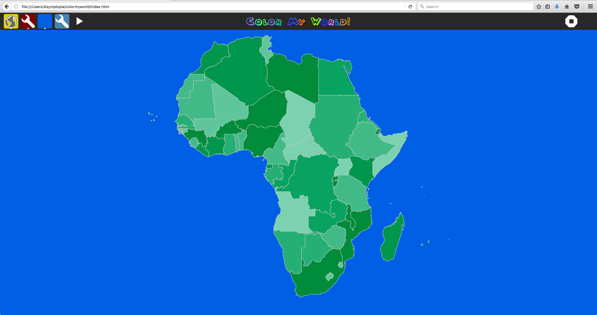
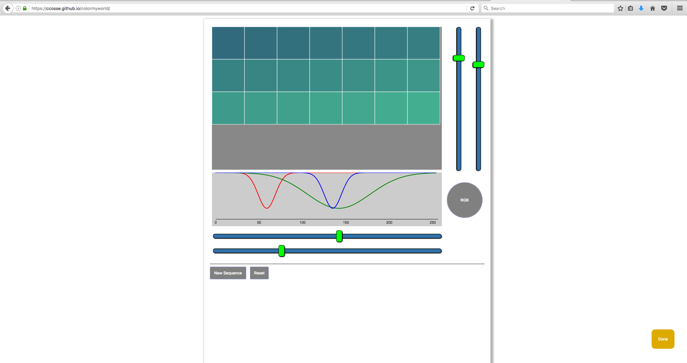
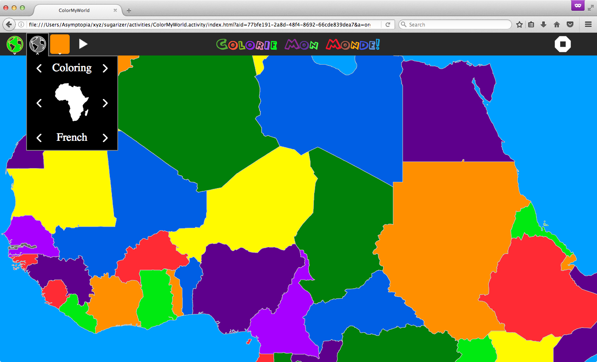

# ColorMyWorld
Geography Scavenger Hunt [Play Online](https://ccosse.github.io/colormyworld/)

Introducing Color Profiles.  Previously, the Tour mode applied random colors.
Random colors [were ugly](img/ugly_random_colors.png)!  Now only colors from
your enabled sequences are randomly applied, with the results below.  Note that
this only affects Tour and Interactive modes.  Coloring mode still uses the
originl color chooser.  The new color-sequence tool is just one implementation
of [this new project](https://github.com/cdbrissac/colorcfg). The resulting images
look like [choropleth maps](https://en.wikipedia.org/wiki/Choropleth_map) but in
this case the colorization is applied randomly for aesthetics and does not
represent any data.
 

 

In Coloring mode the user sets each individual color before clicking on map
countries to apply the color.

## Author:
[Charlie Cosse](http://github.com/ccosse/)

Along the way help came from many people, including Phillip Gajadhar,
everyone at [GIMU Guyana](http://data.gim.gov.gy),
the GIS division at [GGMC Guyana](http://www.ggmc.gov.gy/),
[Lionel Laské](https://github.com/llaske), and others.

## History:
Originally developed for [GIS Day 2015](https://www.facebook.com/search/top/?q=GIS%20Day%20colormyworld), Georgetown Guyana, while I was serving as
a GIS Web Applications Developer at [MNRE](https://www.nre.gov.gy/).
Subsequent improvements were made during an 8 week course taught at [GGMC, Guyana](http://www.ggmc.gov.gy/).
Another round of improvements came in late 2016 while living in stimulating [Portland OR](https://www.meetup.com/cities/us/or/portland/tech/), and integrating it with the [NetDispenser](https://netdispenser.github.io/). In 2017 I ported it to [Sugarizer](http://sugarizer.org/) with help from Lionel Laské as part of the [same experiment](https://netdispenser.github.io/). [ColorMyWorld](https://github.com/ccosse/colormyworld) was a featured activity in
[our demo](https://us.pycon.org/2017/schedule/presentation/643/) at [PyCon2017](https://flic.kr/y/2GSVF7K).
In June 2017 I developed [this prototype color-sequence tool](https://github.com/cdbrissac/colorcfg), in-part to address the ugly random colorization during Tour mode.

## More Credits
The backbone and heart of this application is the [Open Layers](http://openlayers.org/) library.
The new color-sequence tool uses [D3.js](http://d3js.org).  D3js can draw maps, too ... [fancy maps](https://www.jasondavies.com/maps/)!
So I'm looking at phasing-out Open Layers, JQuery and Bootstrap and using D3 exclusively, forever.
Even though it's not specifically used in ColorMyWorld, [Python](http://python.org) and [Django](https://www.djangoproject.com/) have
been important parts of my GIS experience.  I also learned a lot working on [GeoNode](http://geonode.org/)
and while developing this [Custom GIS CMS](http://dev.asymptopia.org/pacmap/).

### Icons credits:
* Earth by Peter van Driel from the Noun Project
* World Map by Marvdrock from the Noun Project
* North America by Marvdrock from the Noun Project
* South America by Marvdrock from the Noun Project
* Europe by Marvdrock from the Noun Project
* Asia by Marvdrock from the Noun Project
* Oceania by Marvdrock from the Noun Project
