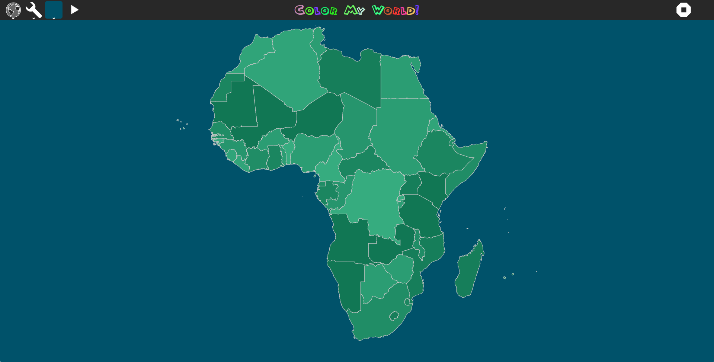

# colormyworld
Geography Scavenger Hunt by <a href="http://github.com/ccosse/">Charles Cosse</a>
[Available Online](http://dev.asymptopia.org/static/colormyworld)

Introducing Color Profiles ... (this is a green profile)

This is the old way, with carefully (manually) selected colors.  The random
coloration led to some ugly results ... almost always.  Color profiles can
restrict the palette to only your favorite colors now.  Or soon ...

Icons credits:

* Earth by Peter van Driel from the Noun Project
* World Map by Marvdrock from the Noun Project
* North America by Marvdrock from the Noun Project
* South America by Marvdrock from the Noun Project
* europe by Marvdrock from the Noun Project
* asia by Marvdrock from the Noun Project
* Oceania by Marvdrock from the Noun Project
