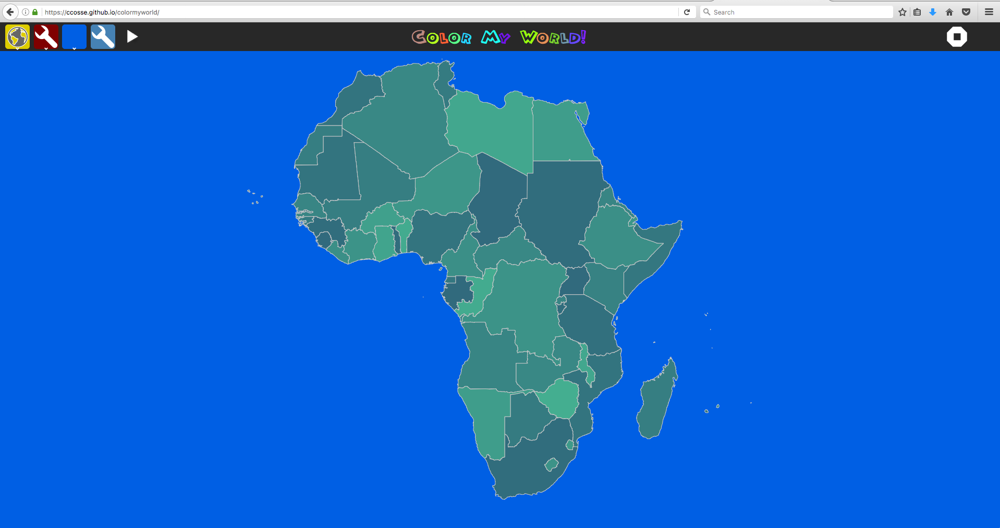

# ColorMyWorld
Geography Scavenger Hunt [Online](http://dev.asymptopia.org/static/colormyworld)

Introducing Color Profiles.  Previously, the Tour mode applied random colors.
Random colors [were ugly](img/ugly_random_colors.png)!  Now only colors from
your enabled sequences are randomly applied, with the results below.  Note that
this only affects Tour and Interactive modes.  Coloring mode still uses the
originl color chooser.  The new color-sequence tool is just one implementation
of [this new project](https://github.com/ccosse/colorcfg).

This was done in "Coloring" mode, where the user sets each individual color
before clicking on map countries to apply the color.

## Author:
<a href="http://github.com/ccosse/">Charles Cossé</a>
with help from many people, including Phillip Ghajadar ([GIMU Guyana](http://data.gim.gov.gy)),
Donald Singh and [GGMC Guyana](http://www.ggmc.gov.gy/),
[Lionel Laské](https://github.com/llaske)([Sugarizer](http://sugarizer.org/),
[OLPC-Fr](https://olpc-france.org/wiki/index.php?title=Accueil)), and others

## History:
Originally developed for GIS Day 2015, Georgetown Guyana, while I was serving as
a GIS Web Applications Developer with [Peace Corps Response](https://www.peacecorps.gov/volunteer/is-peace-corps-right-for-me/peace-corps-response/).  
Subsequent improvements were made during an 8 week course taught at [GGMC, Guyana](http://www.ggmc.gov.gy/).
Another round of improvements came in late 2016 while living in Stimulating Portland, Oregon, and integrating it with the [NetDispenser](https://netdispenser.github.io/).
In 2017 I ported it to Sugarizer with help from Lionel Laské.  

### Icons credits:
* Earth by Peter van Driel from the Noun Project
* World Map by Marvdrock from the Noun Project
* North America by Marvdrock from the Noun Project
* South America by Marvdrock from the Noun Project
* Europe by Marvdrock from the Noun Project
* Asia by Marvdrock from the Noun Project
* Oceania by Marvdrock from the Noun Project
